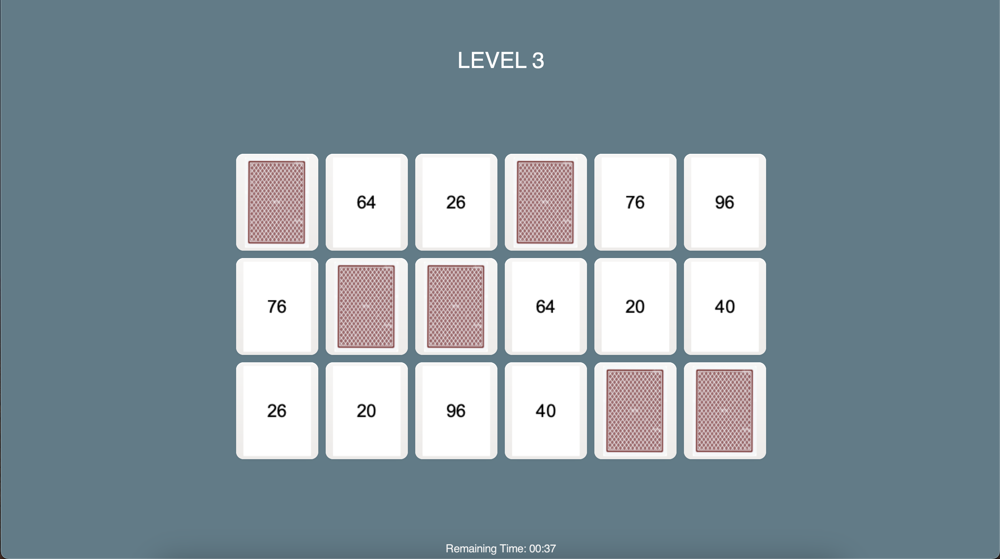
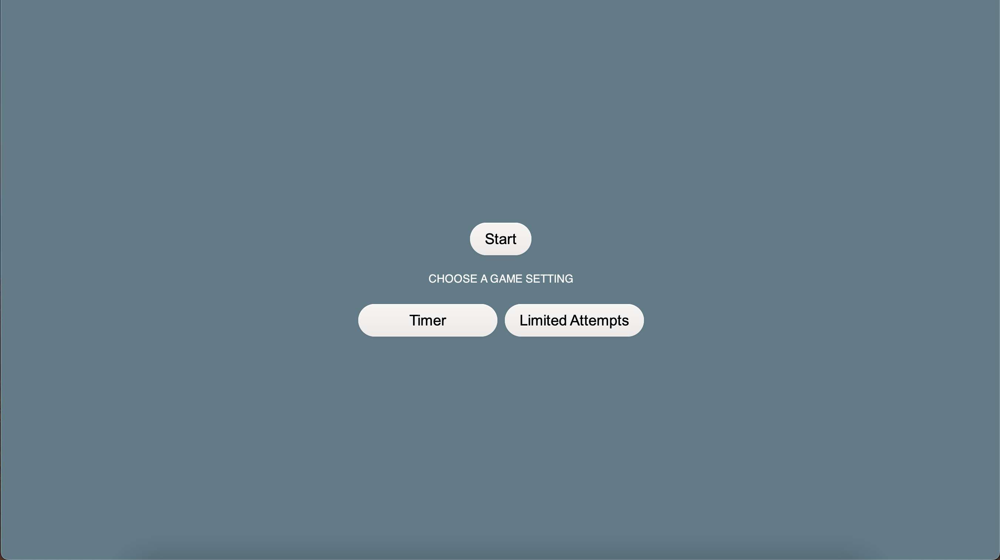
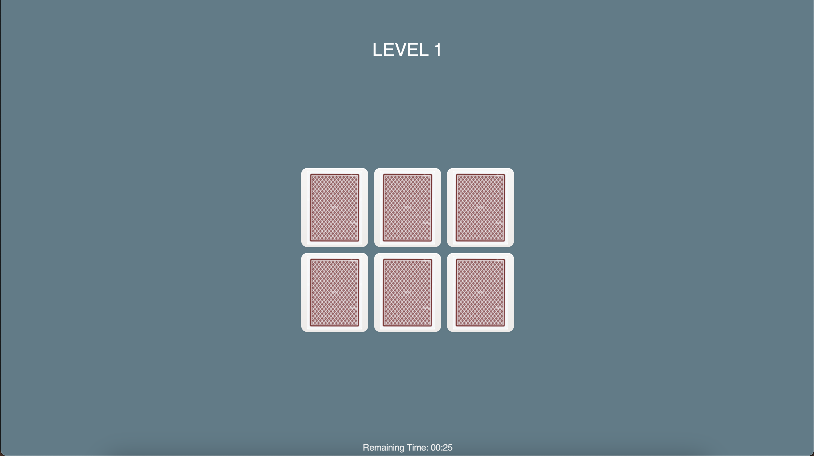
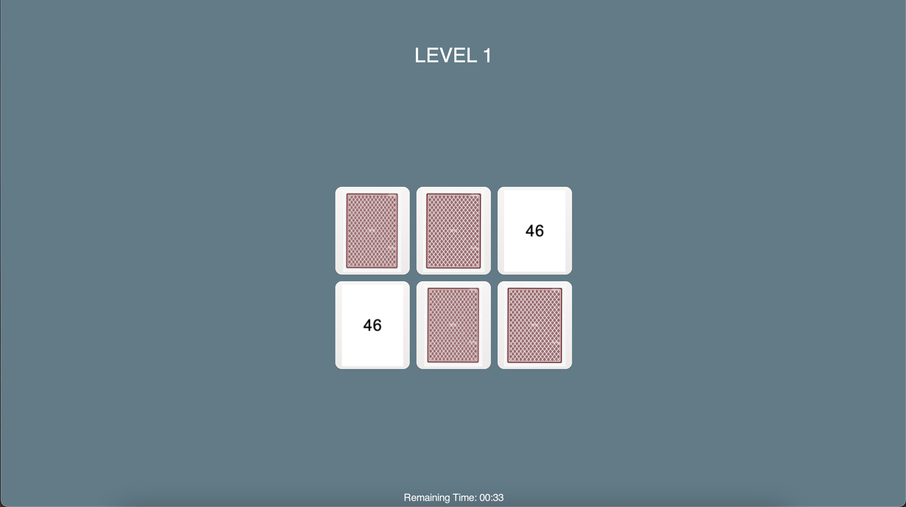

# Memory Card Matching Game

<div style="display: flex;">
  
</div>

## Introduction 
This memory matching game is a fun and engaging project developed in C# using GtkSharp. It challenges players to match pairs of cards under two different modes: a timed mode where players must complete levels within a specific time frame, and a limited attempts mode where players have a fixed number of incorrect guesses allowed. With multiple levels of increasing difficulty, this game is designed to test and improve memory skills in a playful setting.

## Project Structure

The project is structured into several key components, utilizing various classes and libraries:

1. (Game Class): Handles the logic for card initialization, shuffling, and state management of cards (matched or unmatched).

2. (MemoryGame Class):  A subclass of Gtk.Window, it is the main entry point for the GTK application. It manages the UI, game settings, and transitions between different game levels.

3. UI Components:
    - Windows and Dialogs: Manages various GTK windows and dialog components that display the game's levels, settings, and notifications..
    - Buttons and Labels: Used for interactive elements like start, next level, and settings, as well as for displaying timers and attempt counts.

4. Libraries:
    - GtkSharp: Used for all UI components, handling the layout and event management within the application.
    - System.Collections.Generic: For managing collections like arrays and dictionaries which are essential for storing the card states and values.
    - System: Core C# library used for basic operations and utilities like Random for shuffling cards.

5. Assets:
    - img Folder: Contains the image files used within the game and the README file.

## Setup

To run this project, ensure you have set up the required environment:

Clone the repository:
  ```bash
  git clone https://gitlab.mff.cuni.cz/teaching/nprg031/2324-summer/student-rahimlii.git
  cd cd student-rahimlii/ConsoleApplication1
  ```

Add GtkSharp package:
 ```bash
 dotnet add package GtkSharp
 ```

Build the project:
 ```bash
dotnet build
 ```

## Usage

To start the game, navigate to the project directory and run:

 ```bash
dotnet run
 ```

<div style="display: flex;">
  
</div>

Upon launching, you will see the main menu where you can choose between "Timer" and "Limited Attempts" modes. Select a mode to begin playing through the levels. The game progresses with increasing difficulty, and your goal is to match all cards correctly to advance to the next level.

Screenshots:

<div style="display: flex;">
  
   
</div>

## License

This project is licensed under the [MIT License](LICENSE).